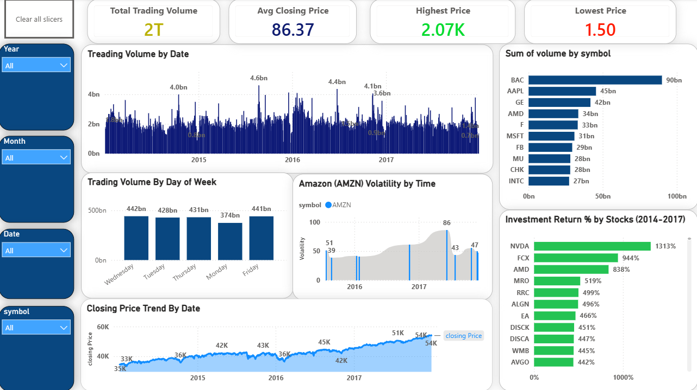

# 🧾 S&P 500 Stock Companies Performance — Analysis

_Analyze S&P 500 Stock Companies Performance , largest overall trading volume, volatility, Top 10 Stocks and support to decision-making using Power BI ,Python ._

---

## 📌 Table of Contents
- <a href="#overview">Overview</a>
- <a href="#business-problem">Business Problem</a>
- <a href="#dataset">Dataset</a>
- <a href="#tools--technologies">Tools & Technologies</a>
- <a href="#project-structure">Project Structure</a>

- <a href="#exploratory-data-analysis-eda">Exploratory Data Analysis (EDA)</a>
- <a href="#research-questions--key-findings">Research Questions & Key Findings</a>
- <a href="#dashboard">Dashboard</a>
- <a href="#how-to-run-this-project">How to Run This Project</a>
- <a href="#final-recommendations">Final Recommendations</a>
- <a href="#author--contact">Author & Contact</a>

---
<h2><a class="anchor" id="overview"></a>Overview</h2>

S&P 500 stock price analysis (2014–2017) using pandas to explore trading volume patterns, price volatility, and historical returns across 505 stocks. Answers four key questions: peak trading volume dates, weekday volume trends, Amazon's most volatile trading day, and the best-performing stock to buy and hold. It combines exploratory data analysis with an interactive dashboard to turn raw sales data into actionable business insights. 
---
<h2><a class="anchor" id="business-problem"></a>Business Problem</h2>

This project addresses the challenge investors and analysts face when trying to extract actionable insights from large-scale historical stock market data. With daily price and volume records for 505 S&P 500 companies spanning four years, identifying meaningful patterns. Questions to answer:
1. Which date saw the largest overall trading volume?
2. On which day of the week is volume highest / lowest, on average?
3. On which date did Amazon (AMZN) see the most volatility (high − low)?
4. Which single stock, bought on 1/2/2014 and held to 12/29/2017, would have delivered the best return?

---
<h2><a class="anchor" id="dataset"></a>Dataset</h2>

- CSV file located in `/data/` folder (S&P_500_Stock_Prices_2014_2017)

---

<h2><a class="anchor" id="tools--technologies"></a>Tools & Technologies</h2>

- Python (Pandas, Matplotlib, Seaborn)
- Power BI (Dashboard Development, Data Visualization)
- Excel
- GitHub

---
<h2><a class="anchor" id="project-structure"></a>Project Structure</h2>

```
vendor-performance-analysis/
│
├── README.md
├── .gitignore
├── requirements.txt
├── S&P 500 Stock Companies Report.pdf
│
├── notebooks/                  # Jupyter notebooks
│   └── S&P 500 Stock Prices Notebook.ipynb
│
├── dashboard/                  # Power BI dashboard file
│   └── S&P 500 Stock Companies Dashboard.pbix
```

---
<h2><a class="anchor" id="exploratory-data-analysis-eda"></a>Exploratory Data Analysis (EDA)</h2>

**Total Records: 4,97,461 | Symbols: 505 | Date Range: 1/2/2014 – 12/29/2017 | Total Volume: 21,160 Cr shares
- Total trading volume peaked on 2015-08-24 (46.08 Cr shares), coinciding with a global market sell-off; the lowest-volume day was 2017-11-24 (7.28 Cr shares), a post-Thanksgiving half-day
- Volume is consistently highest on Fridays (avg 219 Cr) and lowest on Mondays (avg 199 Cr) — a modest but steady weekday pattern (~10% swing)
- PCLN (Priceline, avg close ~$1,390), GOOGL (~$723), and GOOG (~$714) command the highest average share prices, while most S&P 500 constituents trade well under $100
- NVDA was the standout performer, gaining ~1,120% from 1/2/2014 to 12/29/2017 — far ahead of the next-best gainers (AVGO ~388%, EA ~360%)
- Rating is oddly concentrated at 4.0 (3,300+ of 8,523 records) — unusually spiky for real customer feedback; may be a default/assigned value rather than genuine ratings
- AMZN's most volatile session was 2017-06-09, with an $86 high-low spread — an outsized single-day range versus its typical daily swing


---
<h2><a class="anchor" id="research-questions--key-findings"></a>Questions </h2>

1. Which date saw the largest overall trading volume?
2. On which day of the week is volume highest / lowest, on average?
3. On which date did Amazon (AMZN) see the most volatility (high − low)?
4. Which single stock, bought on 1/2/2014 and held to 12/29/2017, would have delivered the best return?


---
<h2><a class="anchor" id="dashboard"></a>Dashboard</h2>

- Power BI Dashboard shows:
  - Treading Volume by Time
  - Closing Price by trend
  - Investment Return(2014-2017)
  - AMZN volatility



---
<h2><a class="anchor" id="how-to-run-this-project"></a>How to Run This Project</h2>

1. Clone the repository:
```bash
[https://github.com/kleditsbat-art/S-P-500-Stock-Performance-Analysis-PowerBI-Python-Excel.git]
```
2. Open and run notebooks:
   - `S&P 500 Stock Prices Notebook.ipynb`
3. Open Power BI Dashboard:
   - `S&P 500 Stock Companies Dashboard.pbix`

---
<h2><a class="anchor" id="final-recommendations"></a>Final Recommendations</h2>

- Largest overall trading volume: 2015-08-24, with ~4.61 billion shares traded across all stocks — this coincides with the global "Black Monday" market sell-off.
- Volume by day of week: Friday sees the highest average volume (~2.19B shares/day); Monday sees the lowest (~1.99B shares/day). Tuesday–Thursday fall in between, fairly close together.
- AMZN's most volatile day: 2017-06-09, with a high−low spread of ~$85.99 — its largest single-day price range in the dataset.
- Best stock to buy-and-hold (1/2/2014 → 12/29/2017): NVDA (Nvidia), with a gain of ~1,120%. It far outpaced the next-best performers (AVGO ~388%, EA ~360%, ALGN ~290%).

---
<h2><a class="anchor" id="author--contact"></a>Author & Contact</h2>

**Kartik Lokare**  
Data Analyst  
- 📧 Email: [kartiklokare8@gmali.com](kartiklokare8@gmali.com)
- 🔗 [LinkedIn](linkedin.com/in/kartik-lokare-5521a7395)  
- 🔗 [Portfolio](https://github.com/kleditsbat-art?tab=repositories)
